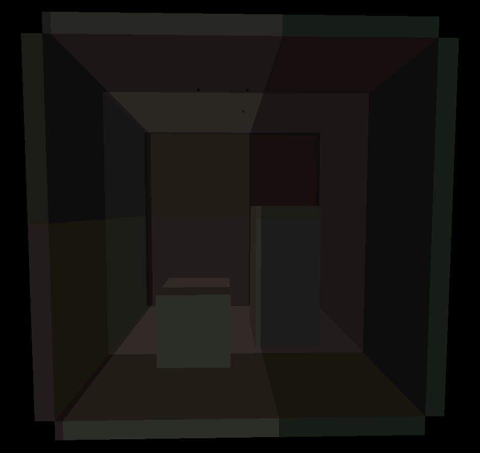
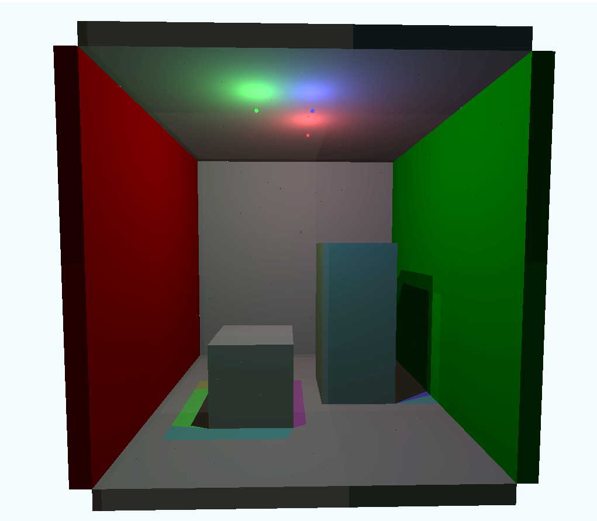

Dynamic Diffuse Global Illumination in Mini-Minecraft (DDGI Minecraft)
======================

**University of Pennsylvania, CIS 565: GPU Programming and Architecture, Final Project**

* Janine Liu
  * [LinkedIn](https://www.linkedin.com/in/liujanine/), [Github](https://github.com/j9liu)
* Spencer Webster-Bass
  * [LinkedIn](https://www.linkedin.com/in/spencer-webster-bass/), [Github](https://github.com/spencerwb)
* Helen (Hanyu) Liu
  * [LinkedIn](https://www.linkedin.com/in/hliu20/), [personal website](http://liuhanyu.net/)

## Table of Contents
 * Introduction
 * Credits
 * Walkthrough
 * Results
 * Performance Analysis

## Introduction

Real-time raytracing has spurred the development of faster rendering techniques to achieve high-quality graphics without dramatically affecting game performance. One topic of study includes real-time global illumination: a recent paper by Majercik, et. al (2019) details a method of approximating indirect lighting, with information updated at every frame based on dynamic lighting and moving scene geometry. The paper, [*Dynamic Diffuse Global Illumination with Ray-Traced Irradiance Fields*](http://jcgt.org/published/0008/02/01/paper-lowres.pdf), is the focus of our project; we aim to implement the algorihm described, while generating our own Minecraft-inspired scenes to test its efficacy in real-time. (We are inspired by a shared interest in Minecraft.)

## Credits

Due to hardware limitations, our team could not take advantage of the Vulkan raytracing extension. Thus, our code is based on the Realtime Vulkan Path Tracer (RVPT) developed [here](https://github.com/GraphicsProgramming/RVPT/), which relies on compute shaders to raytrace scenes. Without this, our Vulkan framework would have taken much longer to setup from scratch.

## Walkthrough

Here we lay out our interpretation of the paper and our implementation details.

### Light Field Probes

To approximate global illumination at points in a scene, we can utilize *light field probes* as described in [*Real-Time Global Illumination using Precomputed Light Field Probes*
](http://casual-effects.com/research/McGuire2017LightField/McGuire2017LightField.pdf) by McGuire et. al (2017). These probes conceptually are spheres dispersed throughout a scene in a grid-based *irradiance field*. This field can be made up of an arbitrary number of probes, but ideally it encapsulates all objects in the scene.

The implementation of these probes in Majercik et. al's paper differs from the McGuire et. al implementation. Before the scene is raytraced, each of the *m* probes sends out *n* rays that potentially intersect with the scene. We find the irradiance value at those intersections, i.e. the direct and indirect lighting at that point, and we also record the distance from the originating probe to that intersection. This information is stored in a texture; each pixel corresponds to a ray from a probe, and the pixels corresponding to one probe are packed together.

|           |                       |
| ------------------------------------ | -------------------------------------- |
| An example of the probe ray texture. | A capture of the scene, for reference. |

### Sampling Probes

After the probes collect their data, the scene is raytraced in a compute shader and rendered to an image on the screen. For every ray that finds an intersection in the scene, we first find the direct lighting at that point. Then, we identify the eight closest probes to that point in the scene. The grid-based structure of the irradiance field allows every point in the scene to be encapsulated in some *probe cage*—a set of eight probes that form a cube surrounding the point.

|                                       |                             |
| ------------------------------------------------------------ | ------------------------------------------------------------ |
| A figure depicting the eight probes around a pixel on the green triangle, taken from the paper. | A debug view of the probe indices that correspond to pixels in the scene. The color corresponds to the index of the bottom, front, leftmost probe in the cage surrounding each pixel. |

Once the probe cage has been determined, we iterate over every probe in the cage and sample the light that the probe sees for that point. More specifically, we get the normal at the point of intersection and find its corresponding pixel in our texture in order to get the indirect lighting data from a probe ray that aligns closely with the direction's normal. In this way, we treat the probe as see-through; we get the irradiance that the probe sees in that direction, then add that to the total irradiance at that point. 

### Weights ###

The paper describes an efficient technique to ensure that the indirect lighting appears to be continuous and accounts for dynamic geometry and lights. His technique is to use the following weights to blend information from the 8 closest probes per intersection: smooth backface weight, trilinear adjacency weight, chebyshev visibility weight, and log perception weight. The smooth backface weight culls indirect contribution by excluding probes that are not mutually visible to the point of intersection. The trilinear adjacency weight interpolates lighting contribution based on the distance between every probe. The chebyshev visibility test (a.k.a. variance shadow mapping) is a technique that counters shadow aliasing by approximating how shadows soften at shadow edges. The log perception weight counters human sensitivity to contrast in low-light conditions by scaling down dimly lit intersections. The log perception weight makes light leaks less apparent to the viewer.

|    |    |
| ---------------------------------- | ------------------------------- |
| Indirect lighting without weights. | Indirect lighting with weights. |

|    |    |
| ---------------------------------- | ------------------------------- |
| Indirect and direct lighting without weights. | Indirect and direct lighting with weights. |

### Scene Generation

To test the real-time efficacy of our DDGI implementation, we procedurally generated a Minecraft-inspired mushroom caves scene; This scene contains a hallowed out cave with openings to the surface and various large mushroom types growing from the ground. The hallowed cave is constructed from a union of different sphere signed distance functions (SDFs), and the floor of the cave is diversified using a fractal brownian noise. As for the mushrooms, there are 4 variations, each made from a different rounded rectangular prism SDF. The mushrooms are strategically placed in the scene so we can utilize bounding box checks to achieve faster a runtime. 

The block textures were also procedurally generated using the UVs at the point of intersection, which we calculated using the intersection position and normal. Using the UVs and intersection position, we were able to generate vertical stripes, dots, and other textures for our scene. 

|                                       |                             |
| ------------------------------------------------------------ | ------------------------------------------------------------ |
| Our textured cave scene without any mushroom, lit using DDGI. | A closer look at one of our mushrooms & textures lit using DDGI. |

When raytracing the scene, we used grid marching in order to find the point of intersection. Grid marching involves traversing down a ray in increments of the smallest distance to the next block, essentially checking every grid block that a ray passes through. At each grid block, we would get its block type based on our procedural scene, and continue marching down the ray if the block type is empty. 

In order to further optimize our program, Majercik, et. al (2019) suggests to use deferred shading. However, due to our use of grid marching to find ray intersections, there was no need to implement deferred shading. Since grid marching returns the closest intersection point to the camera, we only made lighting calculations for that single fragment as opposed to all fragments within a particular pixel like in forward rendering. Similar to deferred shading, the rendering time is independent of the amount of geometry in the scene and is instead only dependent on the number of lights and screen resolution. Thus the runtime is O(num_lights * num_pixels). Also note that grid marching is affected by the structure of the geometry due to the use of signed distance functions to represent the geometry and traverse along a ray. Despite this limitation our program still runs at a decent frame rate, but grid marching could become a potential bottleneck within other scenes.

## Results

*To be updated when the project is finished.*

## Performance Analysis

*To be updated when the project is finished.*
