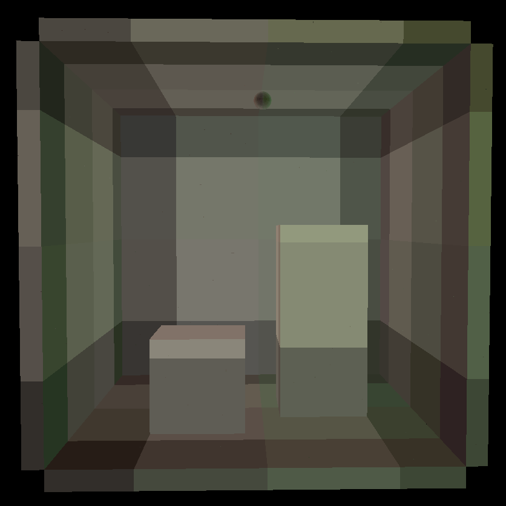
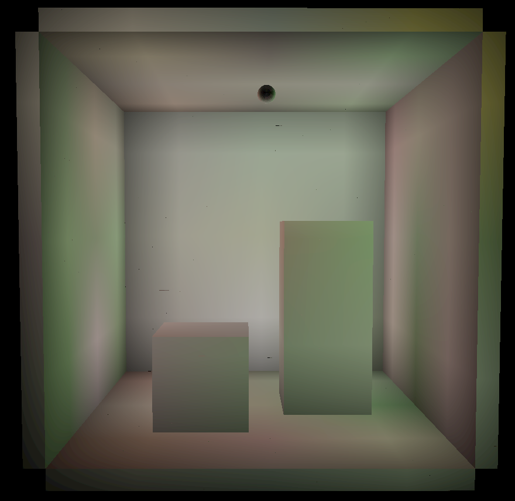

Dynamic Diffuse Global Illumination in Mini-Minecraft (DDGI Minecraft)
======================

**University of Pennsylvania, CIS 565: GPU Programming and Architecture, Final Project**

* Janine Liu
  * [LinkedIn](https://www.linkedin.com/in/liujanine/), [Github](https://github.com/j9liu)
* Spencer Webster-Bass
  * [LinkedIn](https://www.linkedin.com/in/spencer-webster-bass/), [Github](https://github.com/spencerwb)
* Helen (Hanyu) Liu
  * [LinkedIn](https://www.linkedin.com/in/hliu20/), [personal website](http://liuhanyu.net/)

## Table of Contents
<!--ts-->
   * [Introduction](#introduction)
   * [Credits](#credits)
   * [Walkthrough](#walkthrough)
      * [Light Field Probes](#light-field-probes)
      * [Sampling Probes](#sampling-probes)
      * [Weights](#weights)
      * [Scene Generation](#scene-generation)
      * [Dynamic Lights](#dynamic-lights)
   * [Results](#results)
   * [Performance Analysis](#performance-analysis)
      * [Number of Rays per Probe](#number-of-rays-per-probe)
      * [Probe Distance](#probe-distance)
      * [Number of Probes](#number-of-probes)
      * [Procedural Textures](#procedural-textures)
      * [Number of Lights](#number-of-lights)
      * [Dynamic vs. Static Lights](#dynamic-vs-static-lights)
   * [Bloopers](#bloopers)
<!--te-->

## Introduction

Real-time raytracing has spurred the development of faster rendering techniques to achieve high-quality graphics without dramatically affecting game performance. One topic of study includes real-time global illumination: a recent paper by Majercik, et. al (2019) details a method of approximating indirect lighting, with information updated at every frame based on dynamic lighting and moving scene geometry. The paper, [*Dynamic Diffuse Global Illumination with Ray-Traced Irradiance Fields*](http://jcgt.org/published/0008/02/01/paper-lowres.pdf), is the focus of our project; we aim to implement the algorihm described, while generating our own Minecraft-inspired scenes to test its efficacy in real-time. (We are inspired by a shared interest in Minecraft.)

## Credits

Due to hardware limitations, our team could not take advantage of the Vulkan raytracing extension. Thus, our code is based on the Realtime Vulkan Path Tracer (RVPT) developed [here](https://github.com/GraphicsProgramming/RVPT/), which relies on compute shaders to raytrace scenes. Without this, our Vulkan framework would have taken much longer to setup from scratch.

## Walkthrough

Here we lay out our interpretation of the paper and our implementation details.

### Light Field Probes

To approximate global illumination at points in a scene, we can utilize *light field probes* as described in [*Real-Time Global Illumination using Precomputed Light Field Probes*
](http://casual-effects.com/research/McGuire2017LightField/McGuire2017LightField.pdf) by McGuire et. al (2017). These probes conceptually are spheres dispersed throughout a scene in a grid-based *irradiance field*. This field can be made up of an arbitrary number of probes, but ideally it encapsulates all objects in the scene.

The implementation of these probes in Majercik et. al's paper differs from the McGuire et. al implementation. Before the scene is raytraced, each of the *m* probes sends out *n* rays that potentially intersect with the scene. We find the irradiance value at those intersections, i.e. the direct and indirect lighting at that point, and we also record the distance from the originating probe to that intersection. This information is stored in a texture; each pixel corresponds to a ray from a probe, and the pixels corresponding to one probe are packed together.

|  |         
| ------------------------------------- |
| An example of the probe ray texture, derived from the Cornell box scene. Each oblong "cell" of pixels corresponds to a probe in the scene.|

### Sampling Probes

After the probes collect their data, the scene is raytraced in a compute shader and rendered to an image on the screen. For every ray that finds an intersection in the scene, we first find the direct lighting at that point. Then, we identify the eight closest probes to that point in the scene. The grid-based structure of the irradiance field allows every point in the scene to be encapsulated in some *probe cage*—a set of eight probes that form a cube surrounding the point.

|                                       |                             |
| ------------------------------------------------------------ | ------------------------------------------------------------ |
| A figure depicting the eight probes around a pixel on the green triangle, taken from the paper. | A debug view of the probe indices that correspond to pixels in the scene. The color corresponds to the index of the bottom, front, leftmost probe in the cage surrounding each pixel. |

Once the probe cage has been determined, we iterate over every probe in the cage and sample the light that the probe sees for that point. More specifically, we get the normal at the point of intersection and find its corresponding pixel in our texture in order to get the indirect lighting data from a probe ray that aligns closely with the direction's normal. In this way, we treat the probe as see-through; we get the irradiance that the probe sees in that direction, then add that to the total irradiance at that point. 

### Weights ###

The paper describes various methods to ensure that the indirect lighting appears to be continuous and accounts for dynamic geometry and lights. Majercik et. al uses the following weights to blend information from the 8 closest probes per intersection:
- The *smooth backface weight* culls indirect contribution by excluding probes that are not mutually visible to the point of intersection.
- The *trilinear adjacency weight* interpolates lighting contribution based on the distance between every probe.
- The *Chebyshev visibility test* (a.k.a. variance shadow mapping) is a technique that counters shadow aliasing by approximating how shadows soften at shadow edges.
- The *log perception weight* counters human sensitivity to contrast in low-light conditions by scaling down dimly lit intersections. It makes light leaks less apparent to the viewer.

These were implemented as described in the paper, using their supplemental code as reference. However, the Chebyshev visibility test gave us undesirable artifacts, so we have chosen not to include it in our weight calculations.

|    |    |
| ---------------------------------- | ------------------------------- |
| Indirect lighting without weights. | Indirect lighting with weights. |

|    |    |
| ---------------------------------- | ------------------------------- |
| Indirect and direct lighting without weights. | Indirect and direct lighting with weights. |

### Scene Generation

To test the real-time efficacy of our DDGI implementation, we procedurally generated a Minecraft-inspired mushroom caves scene; This scene contains a hallowed out cave with openings to the surface and various large mushroom types growing from the ground. The hallowed cave is constructed from a union of different sphere signed distance functions (SDFs), and the floor of the cave is diversified using a fractal brownian noise. As for the mushrooms, there are 4 variations, each made from a different rounded rectangular prism SDF. The mushrooms are strategically placed in the scene so we can utilize bounding box checks to achieve faster a runtime. 

The block textures were also procedurally generated using the UVs at the point of intersection, which we calculated using the intersection position and normal. Using the UVs and intersection position, we were able to generate vertical stripes, dots, and other textures for our scene. 

|                                       |                             |
| ------------------------------------------------------------ | ------------------------------------------------------------ |
| Our textured cave scene without any mushroom, lit using DDGI. | A closer look at one of our mushrooms & textures lit using DDGI. |

When raytracing the scene, we used grid marching in order to find the point of intersection. Grid marching involves traversing down a ray in increments of the smallest distance to the next block, essentially checking every grid block that a ray passes through. At each grid block, we would get its block type based on our procedural scene, and continue marching down the ray if the block type is empty. 

In order to further optimize our program, Majercik, et. al (2019) suggests to use deferred shading. However, due to our use of grid marching to find ray intersections, there was no need to implement deferred shading. Since grid marching returns the closest intersection point to the camera, we only made lighting calculations for that single fragment as opposed to all fragments within a particular pixel like in forward rendering. Similar to deferred shading, the rendering time is independent of the amount of geometry in the scene and is instead only dependent on the number of lights and screen resolution. Thus the runtime is O(num_lights * num_pixels). Also note that grid marching is affected by the structure of the geometry due to the use of signed distance functions to represent the geometry and traverse along a ray. Despite this limitation our program still runs at a decent frame rate, but grid marching could become a potential bottleneck within other scenes.

## Dynamic Lights

Once we were sure that our program worked with a single, static light we added support for multiple, dynamic lights. The direct lighting with multiple lights is computed by averaging the direct contribution of each non-occluded light. Since indirect lighting is simply a series of accumulated direct lighting calculations, the aforementioned direct lighting calculation can be used multiple times in indirect lighting. To animate the lights, we update the positions of the lights every frame in our compute shaders using the elapsed time and trigonometric functions for periodic motion. For more interesting scenes, we added a light color and intensity to every light. The indirect lighting responds to the dynamic lights through the frame-by-frame update of the probe textures. Consequently, the direct and indirect lighting of every intersection responds to the changing lights in real-time. This approach does have a drawback in that the frame rate drops significantly with multiple lights. We suspect that this slow down is caused by the additional work necessary to compute the direct lighting for each light. Direct lighting computation would thus become a greater issue in the indirect lighting computation since it is the accumulation of multiple direct lighting calculations.

|    |    |
| ---------------------------------- | ------------------------------- |
| Indirect and direct lighting with dynamic lights. | Indirect lighting with dynamic lights. |

## Results

To achieve the image above, we combined our direct lighting and indirecting results, which are both shown below.

|    |    |
| ---------------------------------- | ------------------------------- |
| Direct Lighting Only. Here we see pitch black hard shadows that are not illuminated at all. | Indirect Lighting Only. Here we see the global illumination we were able to estimate using the probes, reflecting color into otherwise pitch-black shadow areas of the scene. |

UI            |  Function
:-------------------------:|:-------------------------:
  |  Our UI window shows the current FPS and lets you change the irradiance field parameters and camera FOV. Press "Recalculate Probes" to recompute the indirect lighting. 

## Performance Analysis

The base code we used for this project came with a built-in FPS counter that displays in the top left corner of the screen. To gauge the performance of our project, we relied on this counter and took an informal estimate of the frames per second. This involved eyeballing the range of values that the counter reached within fifteen seconds, then taking the average of these values and recording it for analysis.

**Important to note:** because we generate the scene with implicit shapes (which requires us to march along rays from the camera into the scene), the FPS will vary based on how close the camera is to visible geometry. For consistency, we attempt to measure FPS from the same camera position for each scene, but the FPS will fluctuate depending on what is in view at any given moment.

In this analysis, we look over these varying parameters and compare the results, both quantitative and qualitiative, of our project.
 - probe-ray count
 - probe distance and placement
 - probe number and density
 - procedural textures
 - number of lights
 - dynamic vs. static lights

Wee use the following parameters for the cave and Cornell scenes unless otherwise specified.

| | Cave   | Cornell |
| :-------------: |:-------------:|:-------------:|
| Probe Dimensions     | (9, 7, 9)     | (5, 5, 5)     |
| Probe Distance      | 11     | 6   |
| Field Origin      | (1.4, 0, 1.0)     | (0, 0, 15)     |

### Number of Rays per Probe

Each probe sends out the same number of rays into the scene. Increasing this number will increase it across the entire irradiance field, and will also lead to an increased probe texture size. Therefore, sending more rays per probe requires more bandwidth and potentially more computational time between the probe-data shader and the raytracing shaders. This is supported by our observations of the FPS counter as we added in more probe rays.

|  |  |

However, it is not enough to say that the less rays there are, the better the performance. A minimum threshold of rays is required for accurate results. Having less rays of probe information leads to different irradiance results.

|  |  |  |
| :-------------: |:-------------:|:-------------:|
| 16 rays per probe | 144 rays per probe | 1600 rays per probe|

Therefore, there is a tradeoff between the performance and the accuracy of the probes, and the balance of both depends on what the viewer deems as the best quality results. Although we found 400 rays per probe an acceptable standard, in other applications the parameter may have to be tweaked from scene to scene.

### Probe Distance

The distance between probes in the field impacts two parts of the shading process. It affects the positions of the probes, and therefore what points the irradiance is sampled from, and it also affects the Chebvyshev weight that we assign to a probe's irradiance, since it relies on the distance from the point to the probe. However, we have disabled Chebvyshev weighting due to unwanted artifacts, so modifying the distance between probes in the irradiance field mainly modifies the results of the probe texture.

|  |  |  |
| :-------------: |:-------------:|:-------------:|
| probe distance: 6| probe distance: 8 | probe distance: 10|

Here we demonstrate the variance in indirect lighting, based on change to the distance between probes in the irradiance field. (The size of the irradiance field itself has not changed.) Clearly, the placement of the probes throughout the scene is significant; beyond some probes being obsecured, the distance between the probes causes the lighting information itself to be more spread out, and potentially less accurate. However, increasing the distance of the probes can reduce the need to light the scene with more probes, which may be a desired tradeoff. Since this parameter has a completely qualitative measure, it's up to the viewer to determine what probe distance is appropriate for the scene, especially in combination with the number of probes.

### Number of Probes

While increasing the number of rays per probe can result in more lighting information, so can increasing the number of probes themselves. The irradiance field can be expanded in all three directions, and the distance between probes can be modified so that the field is more sparse or dense. We explored four different sets of parameters for both the cave and Cornell scenes, as detailed below.

 | Cave   | Layout 1 | Layout 2 | Layout 3 | Layout 4 |
| ------------- |-------------|-------------|-------------|-------------|
| Probe Dimensions     | (7, 5, 5)     | (9, 7, 9)     | (11, 9, 11)     | (15, 15, 15) |
| Probe Distance      | 18     | 11     | 9     | 7     |
| Field Origin      | (-0.2, 0, 1.0)     | (1.4, 0, 1.0)     | (0, 0, 0)     | (0, 0, 0)     |

| Cornell Box  | Layout 1 | Layout 2 | Layout 3 | Layout 4 |
| ------------- |-------------| -------------|-------------|-------------|
| Probe Dimensions     | (3, 3, 3)     | (5, 5, 5)     | (7, 7, 7)     | (11, 11, 11) |
| Probe Distance      | 11     | 6     | 4     | 3     |
| Field Origin      | (0, 0, 15)     | (0, 0, 15)     | (0, 0, 15)     | (0, 0, 15)     |

|  |  |  |  |
| ------------- | ------------- | ------------- | ------------- |
| Layout 1 | Layout 2 | Layout 3 | Layout 4 |

Quantitatively, the framerate drops the more probes that there are in the scene. This is

|  |  |

Qualitatively

|   |  |
| ------------- | ------------- | ------------- |
| Layout 1 | Layout 3 | Layout 4 |

### Procedural Textures

Because we involve noise functions (e.g. Worley noise, fractional brownian motion) to texture our cave, we need additional time to compute the color of a block in that scene. These calculations take up a notable amount of time: if we remove procedural texturing and fill the cave with flat colors, the scene renders at about **75 FPS**, while our use of procedural textures results in **60 FPS**. A **15 FPS** difference is not insignificant.

### Number of Lights

### Dynamic vs. Static Lights

## Bloopers

|             |                             |
| ------------------------------------------------------------ | ------------------------------------------------------------ |
| Here we did not test for points outside irradiance field. | This happened when we sampled probes with the wrong direction. |

|  |                             |
| ------------------------------------------------------------ | ------------------------------------------------------------ |
| Here we had combined direct and indirect lighting incorrectly. No weighting. | Our textures were sampling out of bounds and resulted in incorrect color bleeding. |

